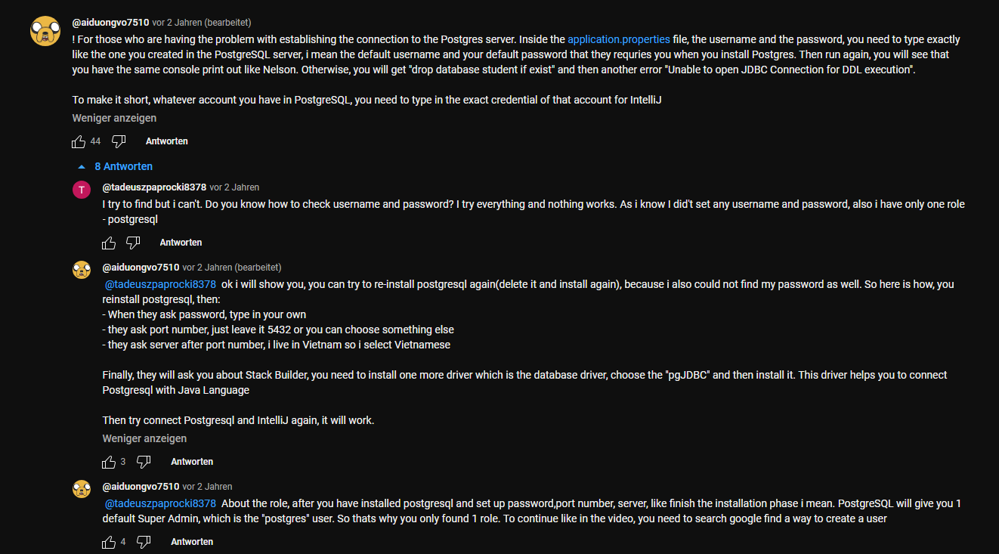
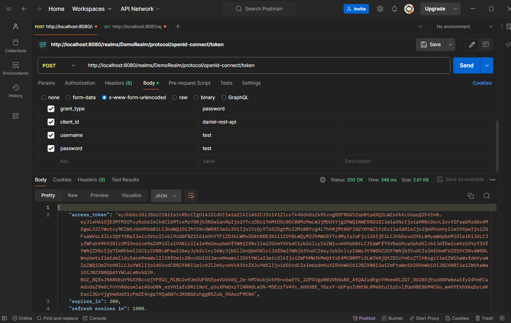

# Arbeitsdokumentation - Diplomarbeit

#### Daniel Lanzerstorfer

#### 19.04.2024

###### Zeit:  11Uhr - 16Uhr

- einstellen und download von  Programmen mit denen gearbeitet wird
  
  - IntelliJ IDE 2024 Ultimate Edition (Programmierumgebung)
    
    - [Download]([Laden Sie IntelliJ IDEA herunter – die führende Java- und Kotlin-IDE](https://www.jetbrains.com/de-de/idea/download/?section=windows))
  
  - PostgreSQL (Datenbank)
    
    - [Installationstutorial]([PostgreSQL Tutorial: How to download and install PostgreSQL on Windows 10 [EN] - YouTube](https://www.youtube.com/watch?v=SPab5WhO18g))
      
      
      
      (Screenshot von der Kommentarsektion des Youtube SpringBoot Tutoriales)
    
    - [Download]([Community DL Page](https://www.enterprisedb.com/downloads/postgres-postgresql-downloads))
  
  - erstellen von eigenem Repository
    
    - [Repo]([GitHub - LanzeDa200244/Diplomarbeit-ABF-SpringBoot](https://github.com/LanzeDa200244/Diplomarbeit-ABF-SpringBoot))
    - [Git Download]([Git - Downloading Package](https://git-scm.com/download/win))

- SpringBoot Demo Projekt um Grundverständnis aufzubauen
  
  - [Tutorial]([Spring Boot Tutorial | Full Course [2023] [NEW] - YouTube](https://www.youtube.com/watch?v=9SGDpanrc8U))
    
       

#### 20.04.204

#### Zeit: 10Uhr - 14Uhr

### **Keycloak x SpringBoot Einführung**

Error beim Versuch mit GET "http://localhost:8081/api/v1/demo" aufzurufen

POST Befehl erzeugt ansich (laut Tutorial) gültigen JSON-WEB-TOKEN (access_token)

#### 

GET liefer einen 401 Unauthorized Error Code zurück

Sollte aber Funktionieren da dieser Befehl einen String "Hello from Keycloack - ADMIN" zurücl geben soll insofern im JWT der User als Role "client:admin" hat. Hat er auch, dennoch kommt der 401 Error Code.

[Tutorial]([Spring boot 3 Keycloak integration for beginners | The complete Guide - YouTube](https://www.youtube.com/watch?v=vmEWywGzWbA))

- zusätlich benötigte Programme
  
  - [Docker](https://docs.docker.com/desktop/install/windows-install/)
    
    - [Installations-Tutorial]([How to install Docker on Windows - 2024 [ step by step guide ] - YouTube](https://www.youtube.com/watch?v=ZyBBv1JmnWQ))
  
  - [Keycloak]([Docker - Keycloak](https://www.keycloak.org/getting-started/getting-started-docker#_start_keycloak))
  
  - [Postman](https://www.postman.com/downloads/)
  
  - [JWT - Token Decoder](https://jwt.io)

#### 21.04.204

###### Zeit: 11Uhr - 13Uhr

Youtube Tutorial vervollständigen und 401 Unauthorized Error probieren zu beheben.

Error besteht weiterhin. Vermutung, dass es an der Java Klasse "SecurityConfig" liegt. Da im Tutorial gezeigten Methoden stand heute "Deprecated" aka veraltet sind und somit man die verschiedenen Methoden anders anschreiben muss.

[Tutorial]([Spring boot 3 Keycloak integration for beginners | The complete Guide - YouTube](https://www.youtube.com/watch?v=vmEWywGzWbA))
